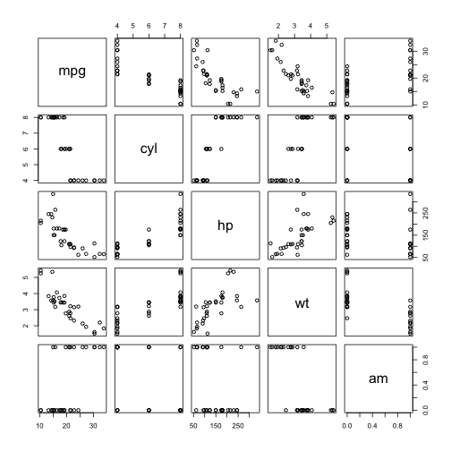
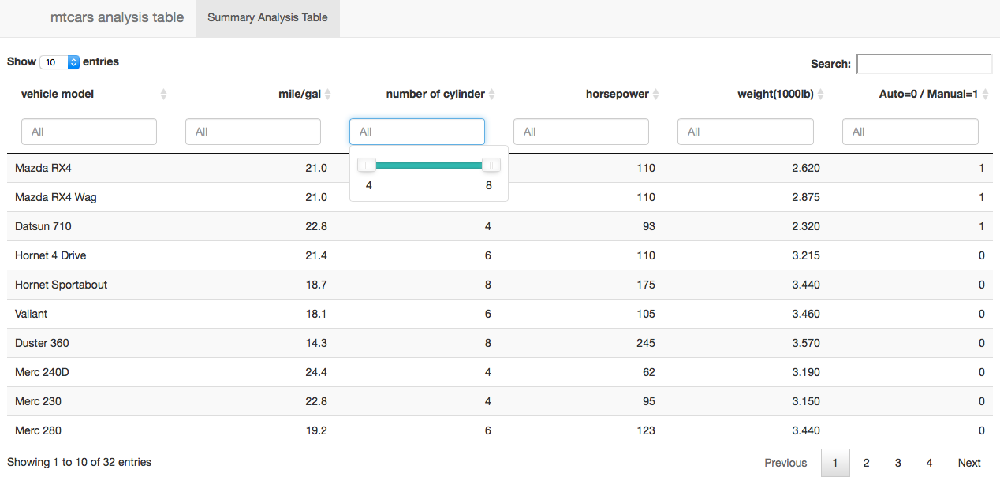

Coursera Developing Data Product Project
========================================================
author: K.Y.
date: Mon Jul 11 14:38:39 2016
autosize: true

Project Overview
========================================================

This is one of the project among the Coursera Data Science Specialization. The Background of this project is to provide the user to find out the relationship of different cars with various factors (models,mpg,cyl,horsepower,weight,transmission).

For application app, please visit
 <https://kyloop.shinyapps.io/Data_Product/>.

For coding information, please visit:
 <https://github.com/kyloop/develop_data_product.git>

Application Overview
========================================================

The is a easy use application, the users only need to choose their desired values the factors related to the vehicles, then the app is able to find out the list of vehicles the users are looking for.

Correlation of vehicles factors with Plot
========================================================

The following is the corelation of vehicles factors: (models,mpg,cyl,horsepower,weight,transmission)

Application Screenshot
========================================================

***
Please check out the screenshot on the left, users are able to slide the option bar to search out which vehicles are fulfilled their criteria.
